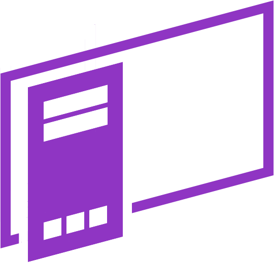

<h1 align="center">
    
    <br>
    Guidenite
</h1>


> Status: **Developing** ⚠️

<div align="center">

</div>

# :page_with_curl: Description
<p>
Guidenite
</p>

# :game_die: Features
- [x] List open windows
- [x] Close windows
- [x] PC shutdown
- [x] Volume mixer
- [x] Screenshot
- [x] Gamepad API Integration

# :gear: How to run the application
1. Clone the repo to your machine.
``` 
git clone https://github.com/gustavohps10/guidenite.git
cd ./guidenite
```
2. Install all project dependencies.
```
yarn install.
```
3. Start webpack --watch.
```
yarn watch
```
4. Start electron.
```
yarn start
```


# :hammer_and_wrench: Technologies
Tools used in the project:
- Electron 19
- React
- JSX
- SCSS

# :adult: Author
Made with 💜 Gustavo Henrique
